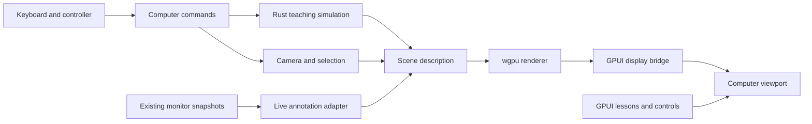

# wgpu for the virtual computer

Research date: 2026-09-21. Status: source review and architecture proposal; no wgpu dependency, renderer, or hardware benchmark has been added.

## Recommendation

Evaluate wgpu as the renderer for the existing educational Computer surface. Keep GPUI responsible for the window, navigation, lessons, text, and terminal; keep the virtual computer's behavior in an independent Rust model. Prove the rendering bridge on the development Mac before committing to richer assets or a framework migration.

This proposal assumes an explorable teaching computer, consistent with `docs/learning/integration-plan.md`. A machine that executes a guest instruction set or boots an operating system would require a separate emulator or virtualization design. wgpu supplies graphics and GPU computation; it does not supply those machine semantics.

## What the repository actually does today

- `app/src/activity/world.rs` defines a camera, keyboard/controller flight, four component stations, and a 2D alternative. It transforms and clips geometry on the CPU, sorts polygon faces by depth, and paints projected paths through GPUI. GPUI still rasterizes those paths on the GPU; this is not a wholly software-rendered app.
- The world has no dedicated 3D depth buffer, material system, or wgpu render pipeline. Its CPU indicator uses a machine-level sample, and the RAM text uses collected memory values. Storage and network remain conceptual.
- `activity/view.rs` passes existing monitor samples to the world. `workspace_view.rs` owns input routing and keeps terminal sessions alive across destinations.
- `app/Cargo.toml` pins GPUI 0.2.2 with `macos-blade`. `Cargo.lock` resolves `blade-graphics` 0.7.1 and Naga 25.0.1; it contains no wgpu package. The Cargo comment calling Blade “wgpu/naga” is imprecise: Blade is a separate graphics library that also uses Naga.
- The installed Blade Metal implementation generates Metal shader source using Naga and calls the runtime Metal library compiler. The documented failure of GPUI's other renderer does not establish that wgpu's Metal backend will fail, but successful Blade rendering is not proof that wgpu works on this hardware either.

These observations come from the current working tree and the installed, pinned dependency source, rather than the older roadmaps.

## What wgpu contributes

wgpu exposes native graphics and compute through a Rust API, with Metal on Apple platforms and other backends for other platforms. It does not require a browser. Its 30.0.1 documentation lists Rust 1.87 as the minimum supported Rust version, below our pinned 1.95.0. That is a compatibility starting point, not a successful build of the combined dependency graph. WGSL is the default shader input; GPU shader programs would normally be small `.wgsl` files alongside the Rust application. [wgpu overview](https://wgpu.rs/), [versioned crate documentation](https://docs.rs/wgpu/30.0.1/wgpu/)

Our proposed uses:

| Experience | Rendering technique | Application logic we still build |
| --- | --- | --- |
| Fly around and inside CPU, RAM, and storage | Meshes, camera uniforms, depth testing, lighting | Scene organization, camera constraints, navigation |
| Inspect a component or memory cell | Highlight pass; CPU ray picking initially | Stable object IDs, selection, lesson links |
| See requests moving between components | Instanced symbols and animated paths | Meaning, timing, origin, destination, explanation |
| Expand a CPU into registers and execution stages | Mesh transforms and transitions | Simplified instruction model and step controls |
| Compare live measurements with a teaching example | Shared renderer with distinct labeled scene inputs | Separate live-data adapter and deterministic simulator |

Depth attachments, vertex/fragment stages, and multisampling are explicit pipeline configuration. Repeated objects can use instanced draw ranges. The application must implement its visual conventions and scene behavior. [Render pipeline descriptor](https://docs.rs/wgpu/30.0.1/wgpu/struct.RenderPipelineDescriptor.html), [render pass API](https://docs.rs/wgpu/30.0.1/wgpu/struct.RenderPass.html)

GPU compute is available for parallel workloads. It could eventually update a large population of illustrative particles. Start with CPU simulation for small instructional workloads: fixed steps, deterministic examples, easy inspection, and unit tests are more valuable initially than parallel throughput. Measure before moving simulation onto the GPU. [Compute pass API](https://docs.rs/wgpu/30.0.1/wgpu/struct.ComputePass.html)

## Proposed separation

Suggested eventual modules are `computer/model.rs`, `simulation.rs`, `scene.rs`, `camera.rs`, `renderer.rs`, and `view.rs`, with shaders under `computer/shaders/`. Extract only as the prototype needs them.

The teaching model owns registers, memory, queues, and events. The renderer receives an immutable description of objects and annotations. A fixed simulation step can emit events such as `MemoryRead`, `CacheMiss`, and `ThreadScheduled`; animation interpolates those events between steps. Visual frame rate must not change the result of an exercise.

Live annotations keep sample age and missing values. A simulated memory address or animated packet must be labeled as an example; current process metrics cannot reveal actual individual memory accesses or packet routes. Reuse the current collector rather than introducing one per view.

## Integration is the first engineering gate

Inspection of GPUI 0.2.2 found a public `RenderImage` containing CPU-accessible BGRA image frames. `Window::paint_image` uploads image data into its sprite atlas, and `Window::drop_image` removes the cached frames. I found no general public wgpu-texture import in the examined display paths. [RenderImage documentation](https://docs.rs/gpui/0.2.2/gpui/struct.RenderImage.html)

The installed macOS `surface` path accepts a `CVPixelBuffer`; the Blade renderer asserts full-range bi-planar YCbCr 4:2:0 and samples separate luma/chroma textures. It is a specialized video path, not an arbitrary BGRA texture bridge. A direct RGBA bridge needs additional work or a renderer extension.

| Approach | Assessment |
| --- | --- |
| Render offscreen, read pixels asynchronously, display a GPUI image | Most accessible first embedded experiment. Adds readback, image upload, and cache lifecycle work. Cap resolution and measure latency. |
| Share a Metal texture through an explicit GPUI/Blade extension | Candidate for sustained performance. Requires resource ownership, same-device or explicit cross-device handling, queue synchronization, and format agreements. Not established as working. |
| Render into a dedicated native child view/layer | Another candidate; must solve clipping, stacking with GPUI overlays, resizing, scale, input, and teardown. Needs a platform integration spike. |
| Use a separate wgpu window | Useful to isolate basic GPU support, but does not prove integration with the existing Computer surface. |
| Extend Blade for 3D instead | Reuses the graphics abstraction already in the dependency graph. GPUI still needs an integration point; common use of Blade alone does not expose its device or command encoder to app code. |

Do not attach an independently presenting renderer to GPUI's existing drawable without explicit coordination. Shared use of Metal or Naga does not make resource types or queue ownership interchangeable. wgpu's native texture escape hatch is unsafe and documents lifetime and backend requirements. [Texture native access](https://docs.rs/wgpu/30.0.1/wgpu/struct.Texture.html#method.as_hal)

For the pixel bridge, copy into a small staging-buffer ring and publish only completed frames. Keep blocking GPU waits off GPUI's foreground thread. Reject obsolete frames after resize, reuse resources, and evict replaced atlas images after their last use. Mapping completion requires polling/submission to make progress, and mapped buffers cannot simultaneously be used by GPU commands. [Buffer mapping contract](https://docs.rs/wgpu/30.0.1/wgpu/struct.Buffer.html#mapping-buffers)

At 1280 × 720 with four bytes per pixel and 60 frames/s, one full-frame transfer represents about 221 MB/s of pixel payload. Readback followed by upload represents about 442 MB/s across both directions before padding or other copies. This is arithmetic, not a measured bus cost; unified-memory and discrete-GPU systems behave differently. Doubling both dimensions quadruples the payload. The readback route might suffice at modest resolution, but cannot be assumed to meet a smooth full-resolution target.

## Small prototype before adoption

1. **Prove the GPU path.** Use a pinned wgpu release with its matching examples. Record the selected Metal adapter, driver/OS context, supported limits, and required texture formats. Render a cube with depth testing into an offscreen texture on the Intel/AMD Mac. Check an Apple Silicon Mac when available. Request only needed capabilities. [Adapter capabilities](https://docs.rs/wgpu/30.0.1/wgpu/struct.Adapter.html)
2. **Prove embedding.** Present that cube inside the existing Computer destination through the pixel bridge. Exercise resize, Retina scale, clipping, text overlays, focus changes, close/reopen, and renderer failure fallback. Compare the existing world against the prototype under the same conditions.
3. **Measure the complete path.** Separate GPU render time, readback completion, GPUI adoption/upload, displayed frame rate, and input latency. Measure memory over repeated frames and repeated navigation. Start at 640 × 360 and 30 fps as experimental limits, then test the actual viewport resolution. Stop frame production while hidden and while idle with no changes.
4. **Build one teaching interaction.** A small explicit program requests a memory value, animates the request and response, updates a register, and exposes Step/Pause/Reset. Tests verify state transitions without any renderer. Reuse current controller ownership and 2D navigation.
5. **Choose the production bridge.** If the measured embedded result is sufficient, keep it bounded. If it is not, investigate a native texture bridge or Blade extension before growing the scene. Retain GPUI for readable labels, lessons, controls, and the terminal.

The renderer's own workload contributes to the machine utilization shown by the monitor. Keep that feedback in mind when evaluating CPU-driven visual effects; increased animation must not accidentally suggest that unrelated applications became busier.

## Primary implementation references

The official version-matched examples include `cube`, `render_to_texture`, `shadow`, and `boids`. These respectively demonstrate basic geometry/transforms, offscreen output, lighting/shadows, and combined compute/render work. `render_to_texture` is the best starting reference for the first embedded experiment; none supplies our GPUI bridge. [Official example catalog](https://github.com/gfx-rs/wgpu/blob/v30/examples/README.md)

This research originally proposed an embedded cube prototype. On 2026-09-21 the user chose the Controller map as the first wgpu challenge instead. That implementation now uses pinned wgpu **29.0.3** (the locally inspected/cached API), an original WGSL illustration, and the offscreen BGRA → GPUI image bridge. GPUI remains on Blade and the Computer scene is unchanged. The single worker keeps one replaceable scene, reuses its target/readback buffer, caps rendering near 30 fps, and pauses while hidden/inactive or unchanged. This modest diagram proves embedding; it does not establish the bridge's suitability for continuous 3D scenes or certify other GPUs. See the [controller checkpoint](../summary/2026-09-21-controller-map.md).
